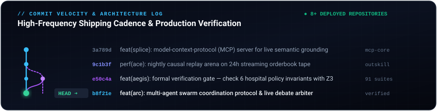

  <!-- Hero Banner -->
  

    

  <!-- Quick Badges -->
  

    
    
    
    
    
  

  

    <strong>Multi-Agent AI Architect · Agentic Systems Engineer · Quantum Computing Researcher</strong>
     
    <em>Building autonomous agent swarms, formally verified kernels, and next-generation developer tooling.</em>
  

---

### ⚡ Engineering Velocity & Commit History

> *"Shipping autonomous, self-healing, and formally verified systems at high velocity."*

  <!-- Custom Git Architecture & Commit Tree Showcase -->
  

 

<!-- Realtime Commit Activity Graph -->

  

 

<!-- GitHub Profile Stats & Commit Streak Stats -->

  <table>
    <tr>
      <td width="50%" align="center">
        
      </td>
      <td width="50%" align="center">
        
      </td>
    </tr>
  </table>

  <!-- Top Languages Breakdown -->
  

---

### 🚀 Flagship Systems & Architectures

<table>
  <thead>
    <tr>
      <th width="35%">System</th>
      <th width="45%">Architecture & Impact</th>
      <th width="20%">Tech Stack</th>
    </tr>
  </thead>
  <tbody>
    <tr>
      <td>
        <strong><a href="https://github.com/arnavnemade1">Arc</a></strong> 
        <em>Universal Multi-Agent Platform</em>  
        
        
      </td>
      <td>
        Autonomous multi-agent platform where specialized agents (CTO, backend engineer, designer, CFO) collaborate in real-time to architect and launch startups. Features a novel agent-coordination protocol with live peer review and consensus arbiter.
      </td>
      <td>
        <code>TypeScript</code> 
        <code>Next.js</code> 
        <code>Vercel</code> 
        <code>Multi-Agent Swarm</code>
      </td>
    </tr>
    <tr>
      <td>
        <strong><a href="https://github.com/arnavnemade1">AegisOS</a></strong> 
        <em>Verified Clinical Paging &amp; Sepsis OS</em>  
        
        
      </td>
      <td>
        Zero-trust clinical triage OS. Every routing decision is formally proved against <strong>6 hospital-policy invariants</strong> via the <strong>Z3 theorem prover</strong> before dispatch. Includes a stacked-ensemble sepsis predictor trained on 24,206 patients, a syscall gate, and 91 failure-injection verification suites.
      </td>
      <td>
        <code>Python</code> 
        <code>FastAPI</code> 
        <code>Z3 Prover</code> 
        <code>Supabase</code> 
        <code>Next.js</code>
      </td>
    </tr>
    <tr>
      <td>
        <strong><a href="https://github.com/arnavnemade1">Ace</a></strong> 
        <em>Autonomous Financial Trading Swarm</em>  
        
      </td>
      <td>
        Swarm of 8–12 specialized LLM agents (data scout, energy analyst, risk sentinel, executor) debating and voting on trade allocations. Features a nightly <strong>Causal Replay Arena</strong> that replays 24h market tape to update causal graphs, live Alpaca paper execution, and an agent observatory.
      </td>
      <td>
        <code>TypeScript</code> 
        <code>Alpaca API</code> 
        <code>Causal Models</code> 
        <code>Discord Bot</code>
      </td>
    </tr>
    <tr>
      <td>
        <strong><a href="https://github.com/arnavnemade1">Splice</a></strong> 
        <em>Web-to-Semantic-Stream MCP Server</em>  
        
      </td>
      <td>
        High-throughput Model Context Protocol (MCP) server turning the live web into a structured semantic data stream. Supplies grounding context directly into agent reasoning loops to minimize hallucinations.
      </td>
      <td>
        <code>TypeScript</code> 
        <code>MCP Protocol</code> 
        <code>Semantic Search</code>
      </td>
    </tr>
  </tbody>
</table>

---

### 🏆 Accolades & Milestones

| Award / Honor | Organization / Venue | Distinction |
| :--- | :--- | :--- |
| **Y Combinator Hackathon** | Y Combinator | 🥉 **3rd Place Overall & MorphLLM Finalist** |
| **NASA Space Apps Challenge** | NASA | 🛰️ **Global Finalist** (EnviroCast Platform) |
| **Congressional App Challenge** | U.S. House of Representatives | 🥈 **2nd Place** (TX-09) |
| **Devpost Hackathons** | Devpost | 🥇 **5x Hackathon Champion** |
| **PicoCTF Cyber Competition** | Carnegie Mellon University | 🛡️ **Ranked 21st Nationally** |
| **Quantum Computing Internship** | Entangle Technology | ⚛️ **Trapped-Ion QC Research** |

---

### 🛠️ Core Tech Radar

<table>
  <tr>
    <td align="left" width="22%"><strong>🤖 Agentic AI &amp; ML</strong></td>
    <td align="left">
      
      
      
      
      
      
    </td>
  </tr>
  <tr>
    <td align="left"><strong>🛡️ Systems &amp; Verification</strong></td>
    <td align="left">
      
      
      
      
    </td>
  </tr>
  <tr>
    <td align="left"><strong>💻 Stack &amp; Infrastructure</strong></td>
    <td align="left">
      
      
      
      
      
      
      
    </td>
  </tr>
</table>

---

  ### 💬 Let's Build Autonomous Systems Together

  
  &nbsp;&nbsp;
  

    
  Designed with precision for <strong>Arnav Nemade</strong> · Multi-Agent AI Architect

